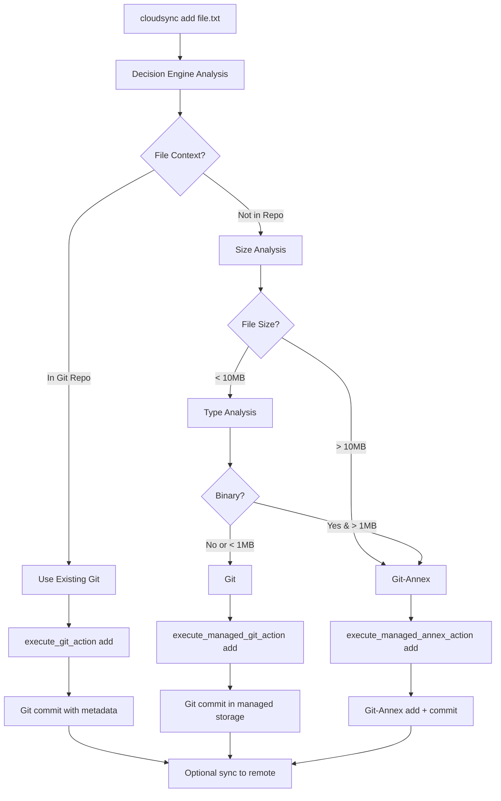
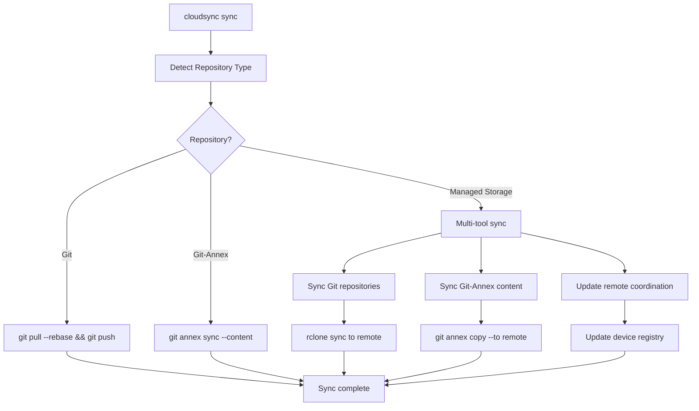
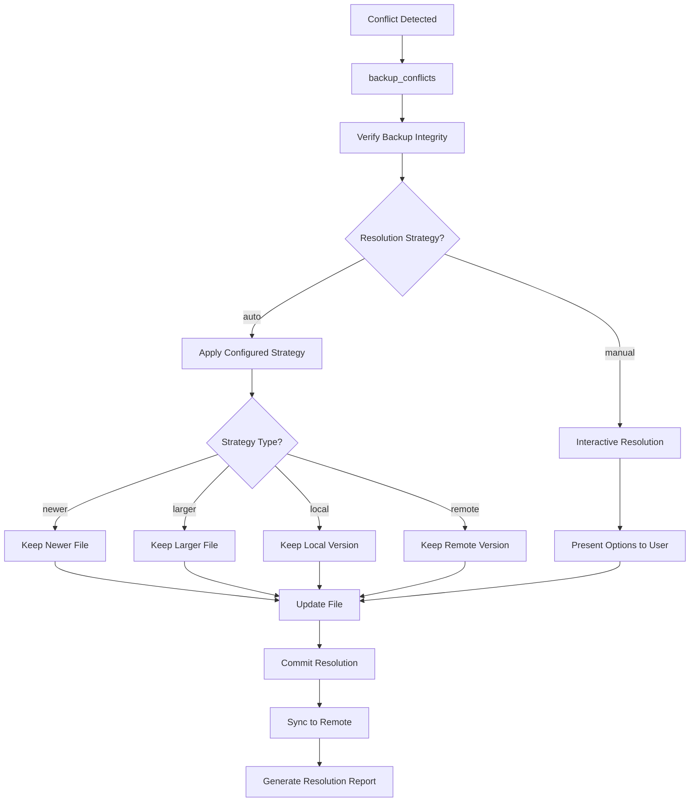

# CloudSync Technical Architecture Reference
**Version:** 2.0 | **Status:** Production Ready | **Date:** 2025-10-04  
**Purpose:** Deep technical reference for LLMs working with CloudSync internals

---

## 🏗️ System Architecture Overview

### High-Level Components

```
┌─────────────────────────────────────────────────────────────┐
│                 CloudSync Orchestrator                      │
│              (scripts/cloudsync-orchestrator.sh)           │
└─────────────┬─────────────┬─────────────┬─────────────────┘
              │             │             │
    ┌─────────▼─────────┐  │  ┌─────────▼─────────┐ ┌─────────▼─────────┐
    │  Decision Engine  │  │  │  Managed Storage  │ │ Conflict Resolver │
    │ (decision-engine  │  │  │ (managed-storage  │ │ (conflict-resolver│
    │     .sh)          │  │  │     .sh)          │ │     .sh)          │
    └─────────┬─────────┘  │  └─────────┬─────────┘ └─────────┬─────────┘
              │             │            │                     │
┌─────────────▼─────────────▼────────────▼─────────────────────▼─────┐
│                     Storage Layer                                   │
├─────────────┬─────────────┬─────────────┬─────────────┬─────────────┤
│     Git     │ Git-Annex   │   rclone    │Bidirectional│Health Check │
│ (< 10MB)    │ (> 10MB)    │(Transport)  │    Sync     │ Monitoring  │
└─────────────┴─────────────┴─────────────┴─────────────┴─────────────┘
```

### Core Components

#### 1. **Orchestrator Layer**
- **`scripts/cloudsync-orchestrator.sh`**: Main user interface
- **`scripts/decision-engine.sh`**: Intelligent tool selection
- **`scripts/managed-storage.sh`**: Git-based storage management

#### 2. **Storage Layer**
- **Git**: Small files, text files, full versioning
- **Git-Annex**: Large files, binary files, pointer versioning
- **rclone**: Transport layer, cloud connectivity

#### 3. **Support Systems**
- **`scripts/core/conflict-resolver.sh`**: Conflict detection and resolution
- **`scripts/core/bidirectional-sync.sh`**: Two-way synchronization
- **`scripts/core/smart-dedupe.sh`**: Deduplication engine
- **`scripts/core/checksum-verify.sh`**: Integrity verification

---

## 🔧 Implementation Details

### Decision Engine Algorithm

**File**: `scripts/decision-engine.sh`

```bash
# Core decision logic (simplified)
analyze_file() {
    local file_path="$1"
    local context="${2:-auto}"
    
    # Context override
    case "$context" in
        "config") echo "git"; return ;;
        "project"|"archive"|"media") echo "git-annex"; return ;;
    esac
    
    # Check if in existing Git repo
    if is_git_repo "$file_path" && [[ "$context" != "managed" ]]; then
        echo "git-existing"
        return
    fi
    
    # File size analysis
    local file_size
    file_size=$(get_file_size "$file_path")
    
    if [[ $file_size -gt $LARGE_FILE_THRESHOLD ]]; then
        echo "git-annex"
        return
    fi
    
    # Binary file check
    if is_binary_file "$file_path" && [[ $file_size -gt $BINARY_FILE_THRESHOLD ]]; then
        echo "git-annex"
        return
    fi
    
    # Default to Git for small text files
    echo "git"
}
```

### File Classification System

**Configuration**: `config/managed-storage.conf`

```bash
# Size thresholds
LARGE_FILE_THRESHOLD=$((10 * 1024 * 1024))  # 10MB
BINARY_FILE_THRESHOLD=$((1 * 1024 * 1024))  # 1MB for binary

# File type patterns
BINARY_EXTENSIONS="jpg|jpeg|png|gif|bmp|tiff|mp4|avi|mkv|mov|mp3|wav|flac|zip|tar|gz|7z|rar|exe|dmg|iso|pdf"
TEXT_EXTENSIONS="txt|md|py|js|ts|jsx|tsx|c|cpp|h|hpp|java|go|rs|sh|bash|zsh|json|xml|yaml|yml|toml|ini|conf|cfg|css|html|scss|sass"

# Directory mapping
GIT_DIRS="configs:documents:scripts"
GIT_ANNEX_DIRS="projects:archives:media"
```

### Storage Organization

#### Managed Storage Structure
```
~/cloudsync-managed/
├── .git/                           # Git repository
│   ├── objects/                    # Git objects
│   ├── refs/                       # Git references
│   └── annex/                      # Git-Annex storage
│       ├── objects/                # Content-addressed storage
│       └── keys/                   # Symlink farm
├── .cloudsync/                     # CloudSync metadata
│   ├── config.json                 # Local configuration
│   ├── device-id                   # Unique device identifier
│   ├── last-sync                   # Sync timestamps
│   └── category-rules.json         # Custom categorization rules
├── configs/                        # Git-managed (any size)
│   ├── application.conf
│   └── settings.yaml
├── documents/                      # Git-managed (< 10MB)
│   ├── README.md
│   └── notes.txt
├── scripts/                        # Git-managed (< 10MB)
│   ├── deploy.sh
│   └── utils.py
├── projects/                       # Git-Annex managed (> 10MB)
│   ├── large-dataset.zip          # → .git/annex/objects/...
│   └── vm-image.vdi               # → .git/annex/objects/...
├── archives/                       # Git-Annex managed
│   ├── backup-2025.tar.gz         # → .git/annex/objects/...
│   └── old-projects.zip           # → .git/annex/objects/...
└── media/                          # Git-Annex managed
    ├── video.mp4                   # → .git/annex/objects/...
    └── photos/                     # Directory with symlinks
        ├── photo1.jpg              # → .git/annex/objects/...
        └── photo2.png              # → .git/annex/objects/...
```

#### Remote Storage Structure
```
onedrive:DevEnvironment/
├── managed/
│   ├── repo.git/                   # Bare Git repository
│   │   ├── objects/                # Git objects (rclone sync)
│   │   ├── refs/                   # References (rclone sync)
│   │   └── HEAD                    # Current branch
│   ├── git-annex-objects/          # Git-Annex content storage
│   │   └── [hash-based-dirs]/      # Content-addressed files
│   └── checksums/                  # Integrity verification
│       ├── git-checksums.md5       # Git object checksums
│       └── annex-checksums.sha256  # Annex content checksums
├── coordination/                   # Multi-device coordination
│   ├── device-registry.json        # Device metadata
│   ├── sync-locks/                 # Distributed locking
│   │   ├── sync-lock-device1.json
│   │   └── sync-lock-device2.json
│   └── conflict-reports/           # Conflict resolution history
└── conflicts/                      # Conflict backups
    ├── backup-20251004-143022/     # Timestamped backups
    │   ├── file1.conflict
    │   └── file2.sync-conflict
    └── resolution-logs/            # Resolution audit trail
        └── resolution-20251004.log
```

---

## 🔄 Operation Workflows

### File Addition Workflow



### Sync Operation Workflow



### Conflict Resolution Workflow



---

## 🗂️ Data Structures

### Device Registry Format
**Location**: `onedrive:DevEnvironment/coordination/device-registry.json`

```json
{
  "devices": {
    "device-uuid-1": {
      "hostname": "laptop-primary",
      "first_seen": "2025-10-01T10:00:00Z",
      "last_sync": "2025-10-04T14:30:22Z",
      "git_annex_uuid": "12345678-abcd-efgh-ijkl-123456789012",
      "capabilities": ["git", "git-annex", "rclone"],
      "status": "active"
    },
    "device-uuid-2": {
      "hostname": "desktop-work",
      "first_seen": "2025-10-02T09:15:00Z",
      "last_sync": "2025-10-04T13:45:10Z",
      "git_annex_uuid": "87654321-dcba-hgfe-lkji-210987654321",
      "capabilities": ["git", "git-annex", "rclone"],
      "status": "active"
    }
  },
  "last_updated": "2025-10-04T14:30:22Z",
  "schema_version": "1.0"
}
```

### Conflict Report Format
**Location**: `~/.cloudsync/conflicts/detected-conflicts.txt`

```
# Format: filepath|conflict_type|detection_time|file_size|checksum
/path/to/file1.txt|sync-conflict|2025-10-04T14:30:22Z|1024|abc123
/path/to/file2.pdf|size-mismatch|2025-10-04T14:31:05Z|2048576|def456
onedrive:DevEnvironment/file3.bin|timestamp-conflict|2025-10-04T14:32:00Z|10485760|789xyz
```

### Configuration Schema
**Location**: `config/managed-storage.conf`

```bash
# Remote Configuration
REMOTE_NAME="onedrive"              # rclone remote name
REMOTE_PATH="DevEnvironment/managed" # remote base path

# Thresholds (bytes)
LARGE_FILE_THRESHOLD=10485760       # 10MB
BINARY_FILE_THRESHOLD=1048576       # 1MB

# Directory Categories
GIT_DIRS="configs:documents:scripts"
GIT_ANNEX_DIRS="projects:archives:media"

# Git Configuration
GIT_USER_NAME="CloudSync"
GIT_USER_EMAIL="cloudsync@local"
GIT_DEFAULT_BRANCH="main"

# Performance Settings
MAX_CONCURRENT_OPS=3
RETRY_ATTEMPTS=3
OPERATION_TIMEOUT=300               # 5 minutes

# Feature Flags
AUTO_SYNC=false
DRY_RUN=false
VERBOSE=false
INTEGRATE_DEDUPLICATION=true
INTEGRATE_HEALTH_MONITORING=true
INTEGRATE_CONFLICT_RESOLUTION=true

# Git-Annex Settings
ANNEX_CHUNK_SIZE="50MiB"
ANNEX_ENCRYPTION="none"
ANNEX_NUMCOPIES=2
```

---

## 🔐 Security Model

### Access Control Layers

1. **File System Permissions**
   - Standard Unix permissions on local files
   - Git repository access controls
   - rclone remote authentication

2. **Git-Annex Encryption**
   - Optional content encryption
   - Configurable encryption methods: `none`, `shared`, `hybrid`, `pubkey`
   - Key management through Git-Annex

3. **Transport Security**
   - rclone handles authentication to cloud providers
   - HTTPS/TLS for all remote operations
   - OAuth2 tokens for cloud service authentication

### Data Integrity

1. **Git Integrity**
   - SHA-1 checksums for all Git objects
   - Cryptographic verification of history
   - Atomic operations prevent corruption

2. **Git-Annex Integrity**
   - Independent content checksums (SHA256)
   - Content verification on transfer
   - Redundant storage with configurable copy counts

3. **Backup Verification**
   - Size verification for all backup operations
   - Existence checks for remote files
   - Automatic cleanup of failed backups

---

## ⚡ Performance Characteristics

### Operation Complexity

| Operation | Time Complexity | Space Complexity | Network I/O |
|-----------|----------------|------------------|-------------|
| Decision Engine | O(1) | O(1) | None |
| Git Add Small File | O(log n) | O(file size) | None |
| Git-Annex Add Large File | O(1) | O(constant) | O(file size) |
| Sync Git Repository | O(changes) | O(changes) | O(changes) |
| Sync Git-Annex Content | O(files) | O(constant) | O(total size) |
| Conflict Detection | O(files) | O(files) | O(metadata) |

### Scalability Limits

- **Maximum file size**: Limited by available disk space
- **Repository size**: Git repos optimal < 1GB, Git-Annex unlimited
- **Number of files**: Git-Annex scales to millions of files
- **Concurrent operations**: Configurable (default: 3)
- **Network bandwidth**: Configurable throttling available

### Optimization Strategies

1. **Chunked Transfers**
   - Large files split into configurable chunks
   - Parallel chunk uploads for better bandwidth utilization
   - Resume capability for interrupted transfers

2. **Deduplication**
   - Content-addressed storage eliminates duplicates
   - Automatic deduplication at Git-Annex level
   - Optional additional deduplication layer

3. **Lazy Loading**
   - Git-Annex content not downloaded until needed
   - `git annex get` on-demand content retrieval
   - Configurable content availability policies

---

## 🔍 Monitoring & Observability

### Log Structure

All logs use structured format:
```
[TIMESTAMP] [LEVEL] [COMPONENT] MESSAGE
[2025-10-04 14:30:22] [INFO] [ORCHESTRATOR] Adding file: document.txt
[2025-10-04 14:30:23] [DEBUG] [DECISION_ENGINE] File size: 1024 bytes, type: text
[2025-10-04 14:30:24] [INFO] [GIT] Committed: Add document.txt
```

### Log Files

- **`~/.cloudsync/logs/orchestrator.log`**: Main operations
- **`~/.cloudsync/logs/decision-engine.log`**: Decision analysis
- **`~/.cloudsync/logs/managed-storage.log`**: Storage operations
- **`~/.cloudsync/logs/conflict-resolver.log`**: Conflict resolution
- **`~/.cloudsync/logs/health-check.log`**: System health monitoring

### Metrics Collection

```bash
# Key metrics tracked:
- Files added per day
- Storage usage by category
- Sync success/failure rates
- Average operation times
- Conflict detection frequency
- Network transfer volumes
```

### Health Monitoring

**File**: `scripts/health-check.sh`

Monitors:
- Disk space availability
- Remote connectivity
- Git repository health
- Git-Annex content availability
- Configuration validity
- Recent error rates

---

## 🧪 Testing Infrastructure

### Test Categories

1. **Unit Tests** (Components)
   - Decision engine logic
   - File classification
   - Configuration parsing
   - Utility functions

2. **Integration Tests** (Workflows)
   - End-to-end file addition
   - Sync operations
   - Conflict resolution
   - Multi-device scenarios

3. **Performance Tests** (Scalability)
   - Large file handling
   - Concurrent operations
   - Network performance
   - Repository size limits

4. **Safety Tests** (Data Protection)
   - Dry-run mode validation
   - Backup verification
   - Rollback procedures
   - Corruption recovery

### Test Execution

```bash
# Component testing
./test-orchestrator.sh              # Main test suite
./tests/test-runner.sh              # Comprehensive framework
./tests/regression/performance-regression.sh  # Performance baselines

# Manual testing
export CLOUDSYNC_DRY_RUN=true       # Safe testing mode
cloudsync add test-file.txt         # Test without changes
```

---

## 🔄 Extension Points

### Custom Decision Rules

**File**: Custom rules file (configurable path)

```bash
# Custom decision logic
custom_decision() {
    local file_path="$1"
    local context="$2"
    
    # Custom logic here
    case "$(basename "$file_path")" in
        *.secret) echo "git-encrypted" ;;
        *.backup) echo "git-annex" ;;
        *) echo "default" ;;
    esac
}
```

### Hook System

**Directory**: Configurable hooks directory

Pre/post hooks for:
- `pre-add`, `post-add`
- `pre-sync`, `post-sync`
- `pre-conflict-resolution`, `post-conflict-resolution`

### Plugin Architecture

Future extension points:
- Custom storage backends
- Alternative sync strategies
- Enhanced conflict resolution algorithms
- Integration with external systems

---

## 📚 API Reference

### Command Line Interface

```bash
# Main commands
cloudsync <command> [options] [arguments]

# Commands:
add <file>                    # Add file with automatic routing
sync [path] [direction]       # Sync to backup location
status <file>                 # Show file status and history
rollback <file> <commit>      # Rollback to previous version
analyze <file>                # Show decision without action
managed-init                  # Initialize managed storage
managed-add <file>            # Force add to managed storage
managed-sync                  # Sync only managed storage
managed-status               # Show managed storage status
```

### Environment Variables

```bash
# Runtime configuration
CLOUDSYNC_VERBOSE=true       # Enable verbose output
CLOUDSYNC_DRY_RUN=true      # Test mode (no changes)
CLOUDSYNC_DEBUG=true        # Debug level logging

# Configuration overrides
CLOUDSYNC_REMOTE_NAME=mydrive
CLOUDSYNC_REMOTE_PATH=MyPath/managed
CLOUDSYNC_AUTO_SYNC=true
```

### Return Codes

```bash
# Standard return codes
0   # Success
1   # General error
2   # Configuration error
3   # Network error
4   # Permission error
5   # File not found
6   # Conflict detected
7   # Operation timeout
```

---

**🎯 This technical reference provides comprehensive implementation details for LLMs working with CloudSync internals, maintenance, and extensions.**